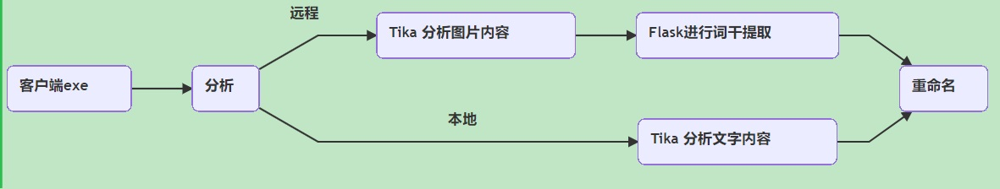

## Python 批量重命名文件

* 一个基于Python的终极重命名机
* a file batch renamer based on python (include Chinese)
* 用于自动对文件夹里大部分类型的文件进行分析，并批量重命名
* 重命名文件自古就是繁琐事情，谁用谁指导
* 方便处理IT办公文件和下载文件夹的杂乱文件
* 简单练手，练手第三方包，编写环节综合到各方面，python初学者必备
* 基于云端和本地，也可以本地
* 对小白提供(exe)，云端提供临时服务器

[](https://github.com/autolordz/file-batch-renamer)
[](https://github.com/autolordz/file-batch-renamer/blob/master/LICENSE)

## Tika版架构


(假如条件不允许可以全部本地化)  

## Updated

- Updated 2019.8.10:
    - **Apache Tika** 版改进，基于云端和本地，终极自动重命名机

- Updated 2019.1.2:  
    - 新版 **Apache Tika** 解析全文件版本 
    - 旧版 **Python 3rd party** 解析文件版本

<!--more-->
----------------

## 环境

* conda : 4.6.14
* python : 3.7.3
* Win10 + Spyder3.3.4 (打开脚本自上而下运行,或者自己添加main来py运行)

* 组件: tika版 
    - [zhon](https://pypi.org/project/zhon/) 提供中文字符
    - [opencv](https://pypi.org/project/opencv-python/) 处理图片,阈值滤镜等
    - [PIL](https://pypi.org/project/Pillow/) 处理图片
    - [fitz](https://pypi.org/project/PyMuPDF/) 提取PDF图片
    - [jieba](https://github.com/fxsjy/jieba) 分词词干识别
    - [numpy,requests,string,json,glob,time,os,re,string,subprocess,configparser,BeautifulSoup4]
    - [Java jre-8u91-windows-x64](https://www.oracle.com/technetwork/java/javase/downloads/java-archive-javase8-2177648.html) Jre8 is at least and fitting package
    - [tika server](https://www.apache.org/dyn/closer.cgi/tika/tika-server-1.22.jar) 工程没附带，一定要下载
    - **Tesseract 云端** 参考云端[Tesseract]安装

* 组件: 普通版 
    - [Tesseract v4.0](https://digi.bib.uni-mannheim.de/tesseract/tesseract-ocr-w32-setup-v4.0.0.20181030.exe) Tesseract for Image OCR
    - [PyPDF2,pdfminer,pytesseract,docx,pptx,xlrd,PIL,extrectImage]

* 打包程序: pyinstaller 

- **以下重点更新和维护Tika版，普通版代码保留**

## 内容

- [x] 按以下格式重命名
    - [x] ['.txt','.html','.epub','.chm','.wps','.md',
             '.doc','.odt','.docx','.xlsx','.csv','.xls','.rtf',
             '.rar','.zip','.tar','.tgz','.7z',
             '.mp4','.gif','.flv','.mkv','.swf','.psd',
             '.mp3','.m4a','.flac',
             '.pdf',]
    - [x] ['.ppt','.pptx','.pptm']
    - [x] ['.png','.jpg','.jpeg','.bmp','.tif']
    - [x] others (rules follow [tika](http://tika.apache.org/1.20/formats.html))

- [x] 过滤下格式非重命名
    - [x] ['.bat','.jar','.exe','.py','.ini']

- [x] 支持平台
    - [x] win7 32bit,win10 64bit,其他平台请按错误修改代码

## 使用

相关文件在flask_app目录

- 云端[tika]部署

```shell
#Centos启动 tika 
nohup java -Djava.awt.headless=true -jar tika-server.jar --host=yourhost --port=3232 >/dev/null &

#Centos终止 
ps -ef | grep tika-server | grep -v grep | awk '{print $2}' | xargs kill -9 
```

- 本地[tika]部署

```shell

#win启动 tika 

start /b java -Djava.awt.headless=true -jar tika-server.jar --config=tika-config.xml --host=127.0.0.1 --port=3232

#[tika-config.xml 用于跳过本地Tesseract,加速非图片文件读取速度]

#Win终止 

taskkill /F /FI "IMAGENAME eq java.exe"
```
- 云端[flask]部署

```shell
#启动
nohup python3 /pyweb/app.py >/dev/null &

#终止 
ps -ef | grep pyweb | grep -v grep | awk '{print $2}' | xargs kill -9
```

- 云端[Tesseract]安装

    - Centos 6.5 安装 Tesseract 4+  
    - 参考 https://www.jianshu.com/p/bf8521703143 差异如下:  
    - autoconf-2.63-5.1.el6.noarch 不用 2.69 也行，保留  
    - 实际安装了 autoconf-archive-2015.02.24-1.sdl6.noarch.rpm  

- 客户端安装
    - installplug.bat -> 安装 java 环境
    - 需要处理文件放在target目录
    - 点击 -> batch-renamer-tika.exe -> 处理target目录
    - cmd -> batch-renamer-tika.py 'yourfile' -> 处理yourfile(文件|目录)

## 未来

- [x] 以文件开始内容命名
- [x] 识别图像内容命名
- [ ] 提取文章(jieba)关键词命名
- [ ] 提取文章摘要(NLP)命名

## Licence

[See Licence](#file-batch-renamer)

That's it,enjoy.


